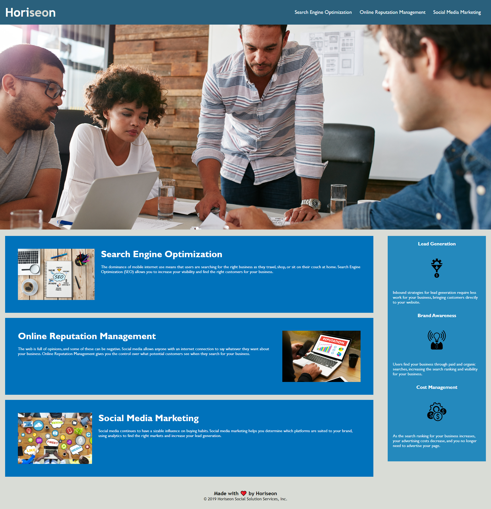

# Horiseon-Website

[](https://opensource.org/licenses/MIT)



## Description

codebase that follows accessibility standards
site is optimized for search engines

the site can be opened via the link -> [here](https://khomych1004.github.io/Horiseon-Website/)


## Installation

N/A

## Usage
```
run index file

```

## Credits

To create the application, I used resources on:
[MDN Web Docs](https://developer.mozilla.org)
||
[GitHub Docs](https://docs.github.com)
||
[W3Schools](https://www.w3schools.com/)
